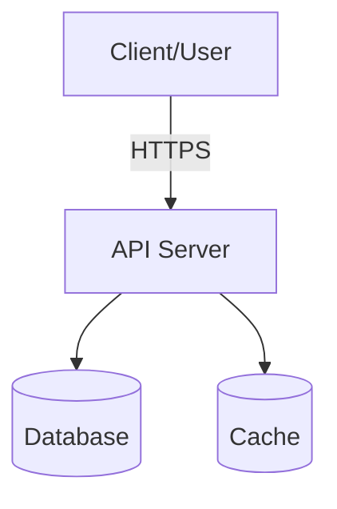
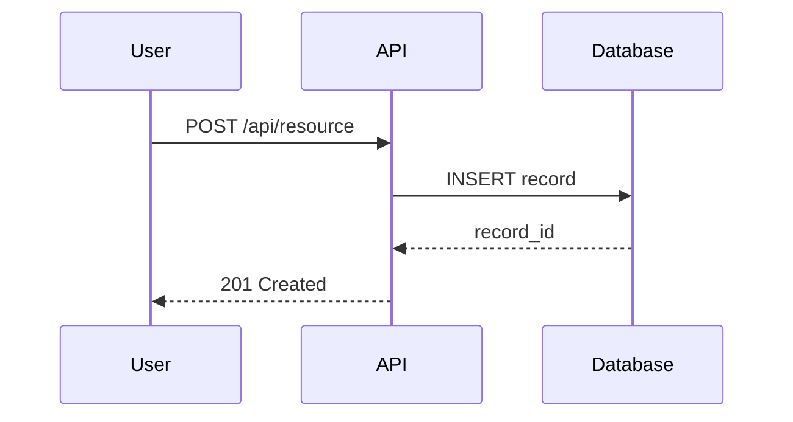

# Repo Scaffold Skill

Generate production-ready repositories using **Copier** and battle-tested community templates.

---

## Approach

This skill uses **Copier** (https://github.com/copier-org/copier) as the scaffolding engine:

1. **Template Updates** — Projects can receive updates when templates evolve
2. **Battle-Tested** — Community templates are production-proven
3. **Fast** — Seconds instead of minutes
4. **Consistent** — Same template = same structure every time
5. **Maintainable** — Leverage community work for core scaffolding

---

## Prerequisites Check

Before scaffolding, verify Copier is installed:

```bash
# Check if copier exists
which copier || pipx install copier

# Verify version (need v9.14.3+)
copier --version
```

If not installed, install it:
```bash
# Preferred: pipx (isolated)
pipx install copier

# Alternative: uv
uv tool install copier

# Alternative: pip
pip install copier
```

---

## Step 0 — Decide if this warrants a full repo

Before scaffolding anything, ask: does this task actually need a repo?

**Yes → full scaffold** when the output is:
- A deployable service, API, or backend
- A library or SDK meant to be reused
- A CLI tool
- A multi-file application
- Something the user will share, maintain, or hand off to others
- Something with infra concerns (DB, auth, queues, deployment)

**No → just write code** when the output is:
- A single script or utility function
- A quick data analysis
- A proof-of-concept/throwaway spike
- Something the user explicitly scoped as small

If in doubt, lean toward the full scaffold — the user asked for it for a reason.

---

## Step 1 — Understand the project

Extract from the conversation (or ask if missing):
- **What it does** — core purpose in one sentence
- **Tech stack** — language, framework, runtime
- **Deployment target** — local only, cloud, Docker, serverless, etc.
- **Audiences** — who will use/maintain this
- **Key integrations** — databases, APIs, external services

Do NOT ask more than 2 clarifying questions. Infer the rest and state your assumptions explicitly.

---

## Step 2 — Select the appropriate community template

Match the project type to the best community template. Use this decision tree:

### Python Projects

**FastAPI / API Service**
```bash
copier copy gh:pawamoy/copier-pdm <output-dir>
# Modern Python API with PDM, Ruff, pytest, CI/CD
# Best for: REST APIs, microservices
```

**Python Library / Package**
```bash
copier copy gh:pawamoy/copier-poetry <output-dir>
# Poetry-based package with full publishing setup
# Best for: Reusable libraries, PyPI packages
```

**Django Application**
```bash
copier copy gh:cookiecutter/cookiecutter-django <output-dir>
# Full Django setup with Docker, PostgreSQL, Redis
# Best for: Web applications, admin panels
```

**Data Science / ML Project**
```bash
copier copy gh:drivendataorg/cookiecutter-data-science <output-dir>
# Standardized data science project structure
# Best for: ML experiments, data analysis
```

**Generic Python Project**
```bash
copier copy gh:cjolowicz/cookiecutter-hypermodern-python <output-dir>
# Modern Python with Poetry, Nox, pre-commit
# Best for: General Python projects
```

### Node / TypeScript Projects

**Next.js Application**
```bash
npx create-next-app@latest <output-dir> --typescript --tailwind --app
# Modern React framework with TypeScript
# Best for: Web apps, SSR, static sites
```

**Express API**
```bash
copier copy gh:hagopj13/node-express-boilerplate <output-dir>
# Production-ready Express.js REST API
# Best for: Node.js APIs, microservices
```

**TypeScript Library**
```bash
copier copy gh:stegano/typescript-library-template <output-dir>
# TypeScript library with bundling and publishing
# Best for: NPM packages, reusable libraries
```

**React Component Library**
```bash
npx create-react-library <output-dir>
# React component library with Rollup
# Best for: UI component libraries
```

### Go Projects

**Go Service / API**
```bash
copier copy gh:lacion/cookiecutter-golang <output-dir>
# Go service with Makefile, Docker, CI
# Best for: APIs, microservices
```

**Go CLI Tool**
```bash
copier copy gh:spf13/cobra-cli <output-dir>
# Cobra-based CLI application
# Best for: Command-line tools
```

### Rust Projects

**Rust Binary / CLI**
```bash
cargo generate --git https://github.com/rust-cli/cli-template <output-dir>
# Rust CLI with clap, error handling, testing
# Best for: CLI tools, system utilities
```

**Rust Library**
```bash
cargo new --lib <output-dir>
# Standard Rust library
# Best for: Reusable crates
```

### Other Languages

**Ruby on Rails**
```bash
rails new <output-dir> --api --database=postgresql
# Rails API with PostgreSQL
# Best for: Ruby APIs, web services
```

**Java Spring Boot**
```bash
curl https://start.spring.io/starter.zip \
  -d dependencies=web,data-jpa,postgresql \
  -d type=maven-project \
  -o <output-dir>.zip && unzip <output-dir>.zip -d <output-dir>
# Spring Boot with JPA and PostgreSQL
# Best for: Enterprise Java applications
```

---

## Step 3 — Execute the template

Run the selected template with Copier:

```bash
# Basic usage
copier copy <template-url> <destination-path>

# With specific answers (non-interactive)
copier copy <template-url> <destination-path> \
  --data project_name="My Project" \
  --data author_name="User Name" \
  --data license="MIT"

# Use defaults for all questions
copier copy <template-url> <destination-path> --defaults
```

### Common Copier Options

- `--vcs-ref <tag>` — Use specific template version
- `--answers-file <file>` — Load answers from YAML file
- `--overwrite` — Overwrite existing files
- `--skip <pattern>` — Skip files matching pattern
- `--data key=value` — Pass template variables
- `--defaults` — Use default values for all questions

---

## Step 4 — Post-generation enhancements

After Copier generates the project, enhance with these additions if missing:

### 4a. Architecture Documentation

If `docs/architecture.md` doesn't exist, create it:

```markdown
# Architecture

## Overview
[System in 3–5 sentences]

## Components
[Each major component: what it is, what it does, how it talks to others]

## Data Flow
[Prose walk-through of the main request/event/data path]

## Key Decisions
[ADR-lite: What, Why, Trade-offs — for 2–4 important choices]

## External Dependencies
| Dependency | Purpose | Documentation |
|------------|---------|---------------|
| ... | ... | ... |
```

### 4b. Mermaid Diagrams

Create `docs/diagrams/` with at minimum:

**System Overview** (`system-overview.mermaid`):


**Data Flow** (`data-flow.mermaid`):


### 4c. Enhance README

Ensure README includes:
- **Quick start** (under 10 lines to run)
- **Configuration table** (.env variables)
- **Development instructions** (install, test, lint)
- **Deployment guide**
- **Link to architecture docs**

### 4d. Verify CI/CD

Check `.github/workflows/` or equivalent includes:
- Linting
- Testing
- Build verification
- Optional: deployment pipeline

---

## Step 5 — Document template updates

Add to project README:

```markdown
## Template Updates

This project was generated from [template-name](template-url).

To receive template updates:
\`\`\`bash
cd <project-directory>
copier update
\`\`\`

Review changes carefully before committing.
```

---

## Step 6 — Deliver the output

### Execution Summary

Provide the user with:

```markdown
## ✅ Generated Repository: <project-name>

**Template**: <template-url>
**Location**: <output-path>

### Structure
<tree output or key directories>

### Key Files
- README.md — Quick start and configuration
- docs/architecture.md — System design (added)
- docs/diagrams/ — Mermaid diagrams (added)
- .github/workflows/ — CI/CD pipelines
- .env.example — Configuration template

### Next Steps
1. Install dependencies: <command>
2. Run tests: <command>
3. Start development: <command>

### Template Updates
\`\`\`bash
cd <project-name>
copier update
\`\`\`
```

---

## Template Selection Guide

Quick reference for choosing templates:

| User Request | Template | Command |
|--------------|----------|---------|
| Python API | pawamoy/copier-pdm | `copier copy gh:pawamoy/copier-pdm` |
| Python library | pawamoy/copier-poetry | `copier copy gh:pawamoy/copier-poetry` |
| Django app | cookiecutter-django | `copier copy gh:cookiecutter/cookiecutter-django` |
| Data science | cookiecutter-data-science | `copier copy gh:drivendataorg/cookiecutter-data-science` |
| Next.js app | create-next-app | `npx create-next-app@latest --typescript` |
| Express API | node-express-boilerplate | `copier copy gh:hagopj13/node-express-boilerplate` |
| Go service | cookiecutter-golang | `copier copy gh:lacion/cookiecutter-golang` |
| Go CLI | cobra-cli | `copier copy gh:spf13/cobra-cli` |
| Rust CLI | rust-cli/cli-template | `cargo generate --git https://github.com/rust-cli/cli-template` |

---

## Quality Checklist

Every scaffolded repo should pass:

- [ ] Clone and run in under 5 minutes
- [ ] README has quick start and config table
- [ ] Architecture documentation exists
- [ ] At least 2 Mermaid diagrams (system, data flow)
- [ ] CI/CD runs on every push
- [ ] .env.example covers all variables
- [ ] .gitignore is complete
- [ ] No secrets or hardcoded credentials
- [ ] Template update instructions documented
- [ ] Follows language/framework conventions

---

## Troubleshooting

### Copier Not Found
```bash
pipx install copier
which copier
copier --version
```

### Template Not Found
```bash
# Use full GitHub URL
copier copy https://github.com/org/template.git output/

# Or GitHub shorthand
copier copy gh:org/template output/
```

### Permission Errors
```bash
mkdir -p /path/to/output
chmod 755 /path/to/output
```

### Template Version Issues
```bash
# Use specific version
copier copy gh:org/template --vcs-ref v1.2.3 output/

# List available versions
git ls-remote --tags https://github.com/org/template.git
```

---

## Summary

This skill orchestrates production-ready repository generation:

- ✅ Leverage battle-tested community templates
- ✅ Generate projects in seconds, not minutes
- ✅ Enable template updates for long-term maintenance
- ✅ Maintain consistency across projects
- ✅ Focus on customization, not boilerplate generation